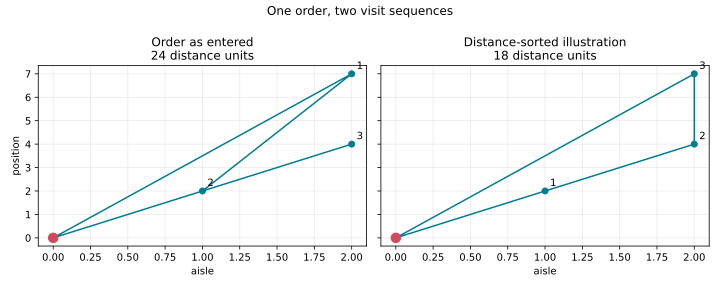

Getting started
===============

Install the locked environment with ``uv`` from the repository root:

.. code-block:: bash

   uv sync --locked --extra eval

Start with the small synthetic example before working with benchmark files.
It constructs one warehouse with three articles, four storage locations, and
one order entirely in memory. The example prints the order demand, the number
of compatible algorithm cards, the assigned pick nodes, and two route lengths.
It also writes a two-panel route plot, so the relationship between the input
order and the distance-sorted illustration is visible rather than hidden in a
large runner script.

Run it with:

.. code-block:: bash

   uv run --locked python examples/getting_started.py --output docs/source/_static/getting_started_routes.svg

The deterministic output is:

.. code-block:: text

   1 order, 3 order lines, 4 storage locations
   Order demand: [(103, 1), (101, 2), (102, 1)]
   Applicable algorithms: 5 of 35
   Assigned pick nodes: [(2, 7), (1, 2), (2, 4)]
   Input order distance: 24
   Distance-sorted illustration: 18
   Difference: 6

The second route is an explanatory comparison, not a replacement for the
routing algorithms. It makes the objective concrete: changing only the visit
sequence changes the distance from 24 to 18 units.

The full example is kept as an executable file at
``examples/getting_started.py``. Change one warehouse fact, such as the number
of blocks or the storage type, and rerun it to see the applicable algorithm
set change.

Check which algorithm configurations apply to the bundled Foodmart Data Card:

.. code-block:: bash

   uv run --locked python examples/list_applicable_algorithms.py

After obtaining the Foodmart benchmark files, synthesize and execute three
pipelines for one instance:

.. code-block:: bash

   uv run --locked python examples/run_one_foodmart_instance.py data/instances/FoodmartData/instances_d5_ord5_MAL.txt --max-pipelines 3

The exact routing and integrated batching-routing configurations require a
Gurobi license. The applicability example and the extension example do not
solve a Gurobi model.
